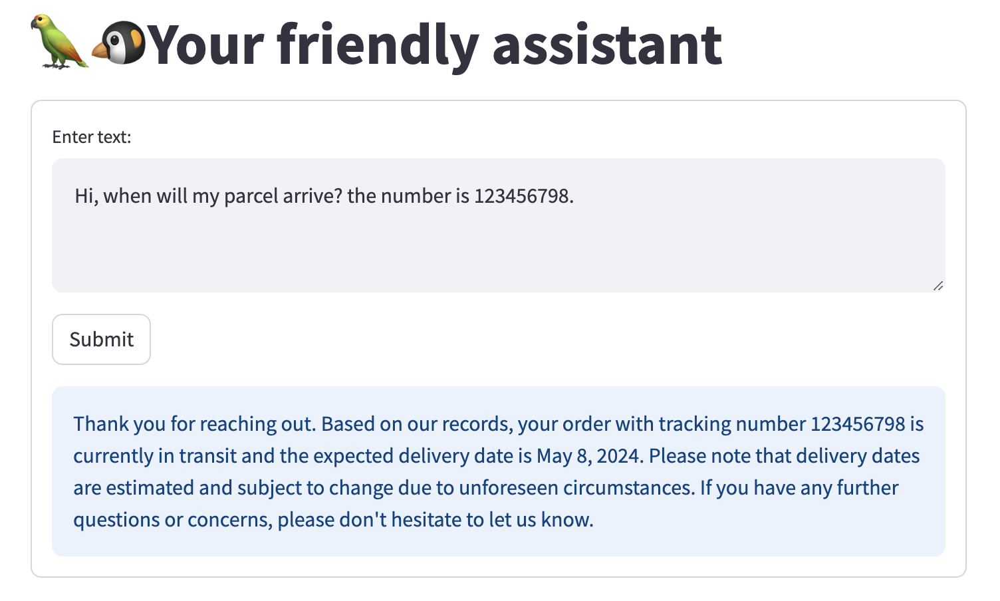
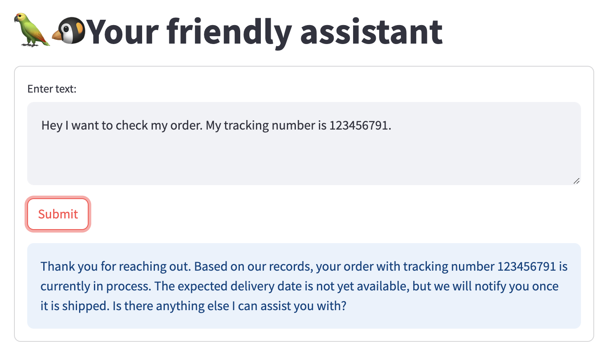
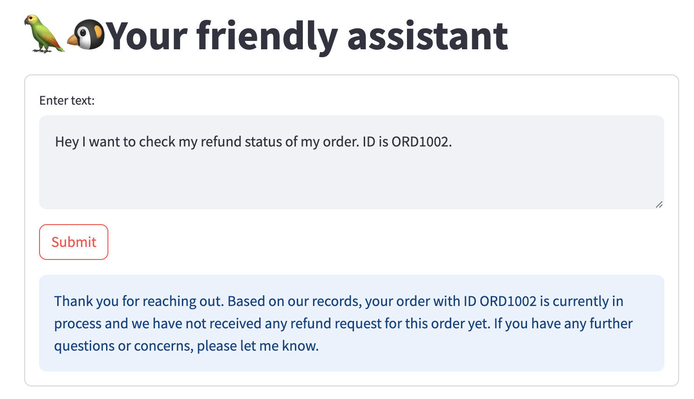

# Customer Service Assistant

This Streamlit application is currently in its early stage. It leverages Langchain and the GPT model to provide a conversational AI interface that assists users with queries about order statuses, refunds, and other order-related information. The current implementation covers basic functionalities, with more features actively under development. The framework is based on the Retrieval-Augmented Generation (RAG) technique to utilize powerful large language models without the need for heavy-resource training.


## Current Features

- Decomposition of user inquiries to identify specific queries.
- Basic information retrieval using Langchain's `SelfQueryRetriever`.
- Initial setup for context compression and response generation (development ongoing).


## Setup

1. **Clone the repository:**

   ```bash
   git clone https://github.com/your-repository/customer-service-assistant.git
   cd customer-service-assistant

2. **Install dependencies:**

    Ensure that you have the required packages installed by running:
    ```bash
    pip install -r requirements.txt
    ```
3. **Set up your OpenAI API Key:**

   Set the `OPENAI_API_KEY` as an environment variable in your operating system or define it in a `.env` file in your project's root directory to keep your credentials secure.

   ```plaintext
   OPENAI_API_KEY='your_openai_api_key_here'
   ```
    This environment variable is required to authenticate requests to the OpenAI API.

4. **Running the App**

    To run the application, use the following command:
    ```
    streamlit run app.py
    ```
## Demo Screenshots

- **Tracking Number Query - Refund Status**:
  - A query with a tracking number that returns the refund status with related date information.
  

- **Order ID Query - expected delivery date **:
  - A query with a order ID that returns the expected delivery date information.


- **Tracking Number Query - Order In Process**:
  - A query with a tracking number that returns an order with the status of "in process."
  

- **Order ID Query - Refund Status**:
  - A query with an order ID that returns the refund status with related date information.
  

- **Order ID Query - Order In Process**:
  - A query about the refund status when the order is just in process.
  

- **General Query - No Specified ID**:
  - A query without specifying an order ID or tracking number.
  

- **Incorrect Order ID Format**:
  - A query with the wrong order ID format.
  

- **Non-Order Related Query**:
  - Description: A query not related to an order.
  