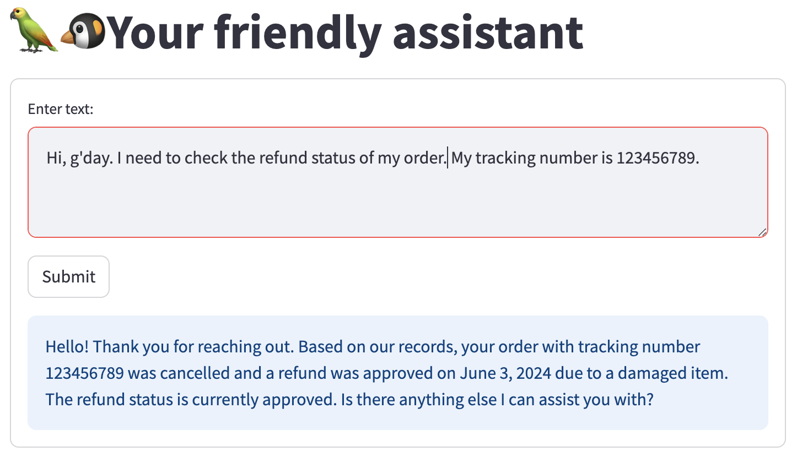

# Customer Service Assistant

This Streamlit application is currently in its early stage. It leverages Langchain and the GPT model to provide a conversational AI interface that assists users with queries about order statuses, refunds, and other order-related information. The current implementation covers basic functionalities, with more features actively under development. The framework is based on the Retrieval-Augmented Generation (RAG) technique to utilize powerful large language models without the need for heavy-resource training.


## Current Features

- Decomposition of user inquiries to identify specific queries.
- Basic information retrieval using Langchain's `SelfQueryRetriever`.
- Initial setup for context compression and response generation (development ongoing).


## Setup

1. **Clone the repository:**

   ```bash
   git clone https://github.com/your-repository/customer-service-assistant.git
   cd customer-service-assistant

2. **Install dependencies:**

    Ensure that you have the required packages installed by running:
    ```bash
    pip install -r requirements.txt
    ```
3. **Set up your OpenAI API Key:**

   Set the `OPENAI_API_KEY` as an environment variable in your operating system or define it in a `.env` file in your project's root directory to keep your credentials secure.

   ```plaintext
   OPENAI_API_KEY='your_openai_api_key_here'
   ```
    This environment variable is required to authenticate requests to the OpenAI API.

4. **Running the App**

    To run the application, use the following command:
    ```
    streamlit run app.py
    ```
## 5. Demo Screenshots





